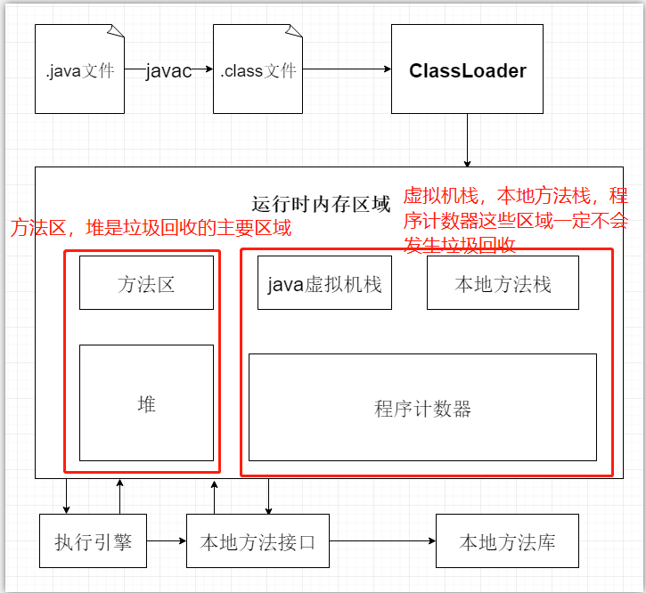

## 回收的是java内存区域的哪些区域



程序计数器，虚拟机栈，本地方法栈是线程私有的，生命周期与线程的生命周期息息相关，**当方法结束或者线程结束时，内存自然也跟着回收了**，所以三个区域一定不会发生垃圾回收

java堆，方法区是垃圾回收的主要区域。

## 如何判断对象为垃圾回收对象

### 引用计数算法

**解释：**

在对象中添加一个引用计数器，当有地方引用这个对象的时候，引用计数器的值+1，当引用失效的时候，计数器的值-1；任何时刻计数器为0的对象就是不可能再被使用的。
**缺点：**

* 计数器维护起来比较麻烦
* 循环引用无法解决

```java
public class TestGc{
    public Object instance = null;
    private static final int _1MB = 1024 * 1024;
    
    private byte[] bigSize = new byte[2 * _1MB];
    
    public static void test(){
        TestGc a = new TestGc();
        TestGc b = new TestGc();
        a.instance = b;
        b.instance = a;
        a = null;
        b = null;
        System.gc();
    }
}
```

### 可达性分析算法

java是通过可达性分析算法来判断对象是否存活。
以gcroot对象为起点，作为一条引用链的链头，如果当一个对象到gcroot没有任何引用链的话，则说明此对象是不可用的，可以被回收。


可以作为gcroot对象的有：

* 虚拟机栈 局部变量表
* 方法区中的静态属性**引用**的对象
* 方法区中的常量**引用**的对象
* 本地方法栈中所**引用**的对象

### 方法区的垃圾回收

回收的两部分内容：

1. 废弃的常量：例如“java”，但是当前系统又没有任何一个字符串对象的值是java，没有字符串对象引用常量池中的"java"常量
2. 不再使用的类型
   - 该类所有的实例都已经被回收，也就是java堆中不存在该类的任何实例。
   - 加载该类的类加载器已经被回收，这个条件除非是经过精心设计的可替换类加载的场景，jsp等，否则很难达成。
   - 该类对应的java.lang.Class对象没有在任何地方被引用，无法在任何地方通过反射访问该类的方法。

## 垃圾回收算法

### 标记-清除算法

首先标记出所有需要回收的对象，在标记完成后统一回收所有被标记的对象。


缺点：

* 效率问题
* 空间问题-会产生大量不连续的内存碎片，空间碎片太多可能导致以后在程序运行过程中需要分配较大的对象时，无法找到足够的连续的内存空间而不得不提前触发一次垃圾回收操作。

### 标记-整理算法

为了解决标记-清除算法会产生大量不连续的内存碎片的问题，对标记-清除算法做了优化，多了一步压缩。


### **<font color="red">复制算法</font>**

作用于新生代，将内存分为一块较大的Eden空间和两块较小的Survivor空间，比例为8:1:1。

每次使用Eden和其中一块Survivor。当回收的时候将Eden和Survivor中还存活着的对象一次性地复制到另外一块Survivor空间上，最后清理掉Eden和刚才用过的Survivor空间，当Survivor空间不够用时，需要依赖老年代进行分配担保。


**绿色方块为幸存对象**

eden和from survivor区里的幸存对象复制到to survivor区，并且清除需要回收的对象。此时之前的to survivor区变成了from survivor区。from survivor区变成了to survivor区，**谁空谁是to**。

**注：当幸存对象经过15次GC还未被回收，那么该对象进入老年代。**

**缺点：**

**内存缩小为原来的一半。**

**在对象存活率较高时就需要进行较多的复制操作，效率将会变低。**

### 分代收集算法

根据对象存活周期的不同将内存划分为几块。

* 新生代-----每次垃圾收集时都发现有大批对象死去，只有少数存活，那就选用复制算法，只需要付出少量存活对象的复制成本，就可以完成收集。
* 老年代-----因为对象存活率高，没有额外空间对它进行分配担保，就必须使用“标记-清理”或者“标记-整理”算法进行回收。

## 垃圾回收器

### serial

* 最基本，发展历史最悠久的收集器
* 单线程的收集器
  * 使用一个CPU或者一条收集线程去完成垃圾收集工作。
  * 进行垃圾回收时，必须暂停其他所有的工作线程，直到它回收结束。
  * 针对新生代；
  * 采用复制算法；

优点：

* 简单而高效
* 依然是虚拟机运行在Client模式下的默认新生代收集器

缺点：

* **遇到垃圾回收就要停下来等单线程的serial垃圾回收，性能上较差**。

参数：

​      **-XX:+UseSerialGC**：添加该参数来显式的使用串行垃圾收集器；

### serial-old

* 是Serial收集器的老年代版本。
* 单线程收集器
* 使用标记-整理算法
* 给Client模式下的虚拟机使用。
* server
  * 在jdk1.5以及之前的版本中与Parallel Scavenge收集器搭配使用。
  * 作为CMS收集器的后备预案，在并发收集发生Concurrent Mode Failure时使用。

### parNew

* Serial的多线程版本。
* 其余行为跟Serial一致。(所有可控参数，收集算法，stop the world,对象分配规则，回收策略)
* 许多运行在Server模式下的虚拟机中首选的新生代收集器
  * 除了Serial收集器外，目前只有它能与CMS（concurrent mark sweep）收集器配合工作
* -XX:+UseConcMarkSweepGC或者-XX:+UseParNewGC来强制指定它作为新生代收集器。
* -XX:ParallelGCThreads参数来限制垃圾收集的线程数。默认是CPU核数。

### parallel Scavenge

* 新生代收集器。
* 复制算法
* 并行的多线程收集器。
* 目的是达到一个可控制的吞吐量（Throughput）--CPU用于运行用户代码的时间与CPU总消耗时间的比值，即吞吐量=运行用户代码时间/（运行用户代码时间+垃圾收集时间）。
* -XX:MaxGCPauseMillis参数控制最大垃圾收集停顿时间。 
  * < 0的毫秒数
  * GC停顿时间缩短是以牺牲吞吐量和新生代空间来换取的。
* -XX:GCTimeRatio参数设置吞吐量的大小。
  * 0 < x < 100的整数
  * 默认99
* -XX:+UseAdaptiveSizePolicy。
  * 这个参数打开后，就不需要手动指定新生代大小（-Xmn）,Eden与Suvivor的比例（-XX:SurvivorRadio）、晋升老年代对象大小（-XX:PretenureSizeThreshold）
* GC自适应的调节策略。
* 无法配合CMS收集器配合工作。

### parallel old

* parallel Scavenge的老年代版本。
* 使用多线程
* 标记整理算法
* jdk1.6
* 如果新生代选择了parallel Scavenge，老年代除了serial old别无选择

### g1

* 面向服务端应用的垃圾收集器。
* 并发与并行。充分利用多CPU,多核环境下的硬件优势，使用多个CPU来缩短Stop The World停顿的时间。
* 分代收集。
* 空间整合。
  * 从整体看，采用了标记-整理算法
  * 从局部看（两个Region）基于复制算法。
* 可预测的停顿。
* 将整个java堆划分为多个大小相等的独立区域（Region），新生代和老年代不再是物理隔离，它们都是一部分Region的集合。
* 避免整个堆进行全区域的垃圾收集。
* 运作流程：
  * 初始标记
  * 并发标记
  * 最终标记
  * 筛选回收

### cms

* Concurrent Mark Sweep
* 以获取最短回收停顿时间为目标的收集器。
* 标记-清除算法。
  * 初始标记（可达性分析法）
  * 并发标记
  * 重新标记
  * 并发清除

优点：

* 并发收集
* 低停顿

缺点：

* 对CPU资源非常敏感
* 无法处理浮动垃圾，可能出现“Concurrent Mode Failure”失败而导致另一次Full GC的产生。
* 大量空间碎片产生。（-XX:+UseCMSCompactAtFullCollection，-XX:CMSFullGCsBeforeCompaction）